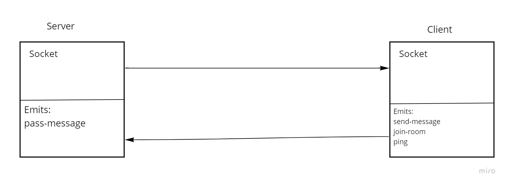

# Realtime-Chat-App

## Project Description

This is real-time chat app that you can chat either with evrybody or you can join a room for private chats.

The project used two libraries and they are:

- **socket.io:**

Socket.io is an amazing library for client/server communication. It was used in this project emit events between the server and the clients and also to create private chat roomes.

- **CORS:**

CORS was used to allow communecation between client and the server as both we running o different ports.

## Application Manual

It's quiete easy to use this application just run the server and the client on your local host and that's it, noting that the client should be ran on port 5500, you can easily do that using the live server extention.

## Submission

[PR Link](https://github.com/karamalqinneh/Realtime-Chat-App/pull/3)

## UML Diagram

